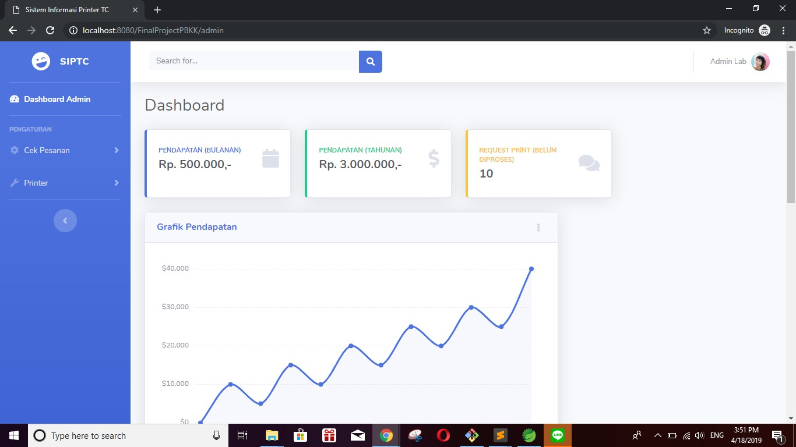
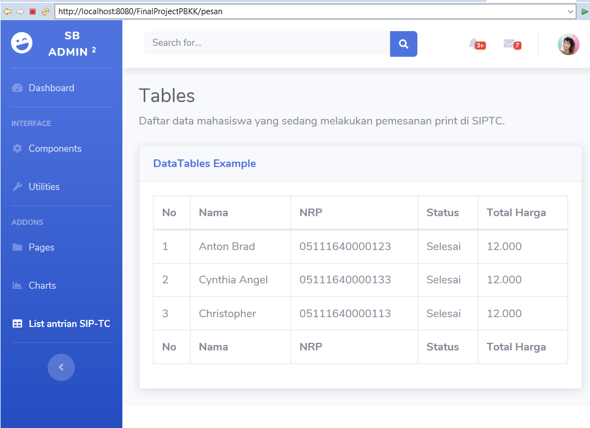

# PBKK-FP
Final project PBKK B

## Anggota Kelompok
1. **Yoga Samudra** 05111540000080
2. **Faturrahman Pranacahya** 05111540000103
3. **M. Faris Didin A.** 05111540000118

## Sistem Informasi Printer TC (SIPTC)  

### Deskripsi  
Merupakan aplikasi yang bertujuan untuk membantu mahasiswa dalam mencetak file atau dokumen di area Informatika. Alur pengguna aplikasi adalah sebagai berikut :  
1. Pengguna membuka website SIPTC.
2. Pengguna mengunggah dokumen yang ingin dicetak.
3. Pengguna menunggu konfirmasi dokumen telah dicetak.
4. Setelah dokumen dicetak pengguna langsung mengambil dokumen di tempat print.

### Permasalahan
- Terlalu banyak antrian saat ingin mencetak dokumen.
- Pencetakan dokumen kadang terkendala kondisi printer.
- Mahasiswa harus mendatangi tempat printer untuk mencetak dokumen.  

#### Halaman Depan Website  

#### Halaman Pesanan Print  
